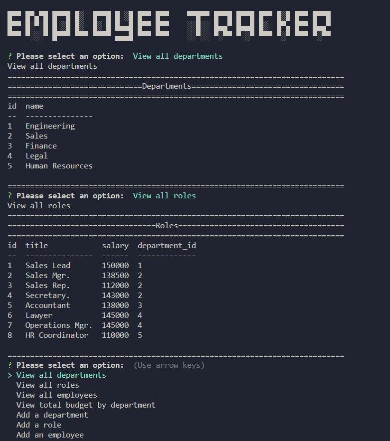

# 🧑‍💼 Employee Tracker

<br>

## Table of contents
- [Description](#📝-description)
- [Overview](#📁-overview)
  - [User experience](#👤-user-experience)
  - [Screenshot](#📸-screenshot)
  - [Links](#🔗-links)
- [My process](#💡-my-process)
  - [Built with](#🔨-built-with)
  - [Useful resources](#📚-useful-resources)
- [Author](#author-✏️)
   - [Grade](#grade)

<br>
<br>

# 📝 Description

- A command-line application that manages a company's employee database, using Node.js, Inquirer, and MySQL.

<br>

# 📁 Overview


## **The Challenge**

​
### User Story
```md
AS A business owner
I WANT to be able to view and manage the departments, roles, and employees in my company
SO THAT I can organize and plan my business
```

## Acceptance Criteria

```md
GIVEN a command-line application that accepts user input
WHEN I start the application
THEN I am presented with the following options: view all departments, view all roles, view all employees, add a department, add a role, add an employee, and update an employee role
WHEN I choose to view all departments
THEN I am presented with a formatted table showing department names and department ids
WHEN I choose to view all roles
THEN I am presented with the job title, role id, the department that role belongs to, and the salary for that role
WHEN I choose to view all employees
THEN I am presented with a formatted table showing employee data, including employee ids, first names, last names, job titles, departments, salaries, and managers that the employees report to
WHEN I choose to add a department
THEN I am prompted to enter the name of the department and that department is added to the database
WHEN I choose to add a role
THEN I am prompted to enter the name, salary, and department for the role and that role is added to the database
WHEN I choose to add an employee
THEN I am prompted to enter the employee’s first name, last name, role, and manager, and that employee is added to the database
WHEN I choose to update an employee role
THEN I am prompted to select an employee to update and their new role and this information is updated in the database 
```

<hr>
<br>

## 👤 User Experience
1. Open command line.
2. Install `npm i` to install your NPM package manager and required dependencies.
3. Install and use Inquirer version 8.2.4 by using the following command in the project folder: `npm i inquirer@8.2.4.`
4. Install and use MySQL2 by using the following command in the project folder: `npm install --save mysql2`
5. Install `npm i dotenv` to store environmental variables.
6. Install `npm i console.table` to print MySQL rows to the console.
7. Run command `mysql -u -root -p` to initilize MySQL, then type username and password to login.
8. Run command `npm run start` or `node server.js` to start.
9. Follow prompts.
10. Run command `quit` to exit the application.

<br>
<hr>
<br>

## 📸 Screenshot 
​<br>

​
<hr>
<br>

## 🔗 Links 
- Live URL: [https://watch.screencastify.com/v/VsSvyhIgvLkT3GcRarLN](https://watch.screencastify.com/v/VsSvyhIgvLkT3GcRarLN)
- GitHub Repo: [https://github.com/AveryCaldwell/Employee-Tracker](https://github.com/AveryCaldwell/Employee-Tracker)


<br>
<hr>
<br>

## 💡 My process 
<br>


### 🔨 Built with 

- JavaScript
- Node.js
- Inquirer
- MySQL
- console.table

<br>

### 📚 Useful resources
- MySQL2 Package:  [https://www.npmjs.com/package/mysql2](https://www.npmjs.com/package/mysql2)
- Inquirer Package:  [https://www.npmjs.com/package/inquirer/v/8.2.4](https://www.npmjs.com/package/inquirer/v/8.2.4)
- console.table Package:  [https://www.npmjs.com/package/console.table](https://www.npmjs.com/package/console.table)
- Emojis: [https://github.com/ikatyang/emoji-cheat-sheet#office](https://github.com/ikatyang/emoji-cheat-sheet)
​

<br>
<hr>
<br>

## Author ✏️
  Avery Caldwell
  - Email: [AveryCaldwell7@gmail.com](AveryCaldwell7@gmail.com)
  - LinkedIn: [https://www.linkedin.com/in/averycaldwell/](https://www.linkedin.com/in/averycaldwell/)
  - GitHub: [https://github.com/AveryCaldwell/](https://github.com/AveryCaldwell/)

  <br>
  
  ### Grade - 100/100
